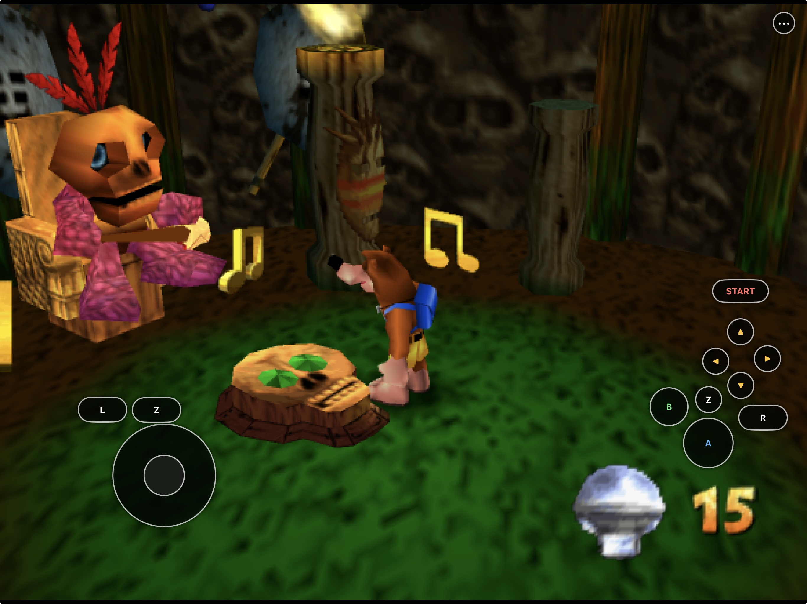
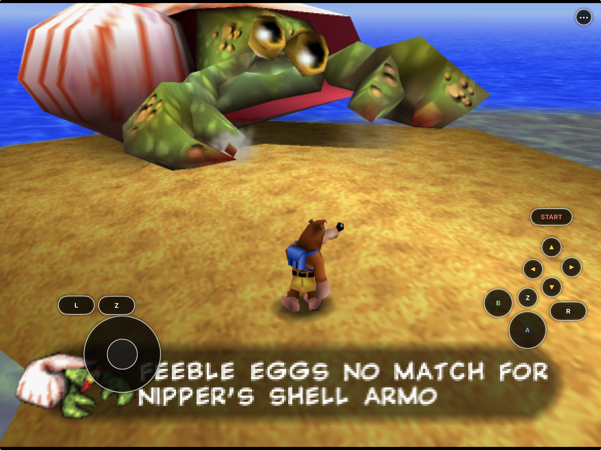
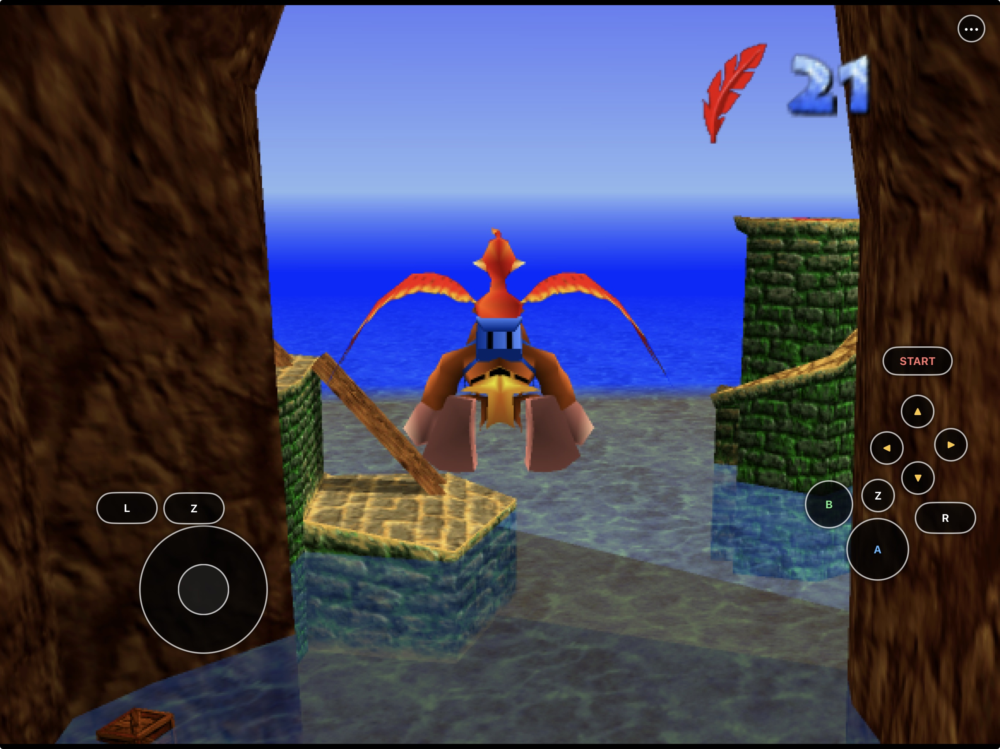
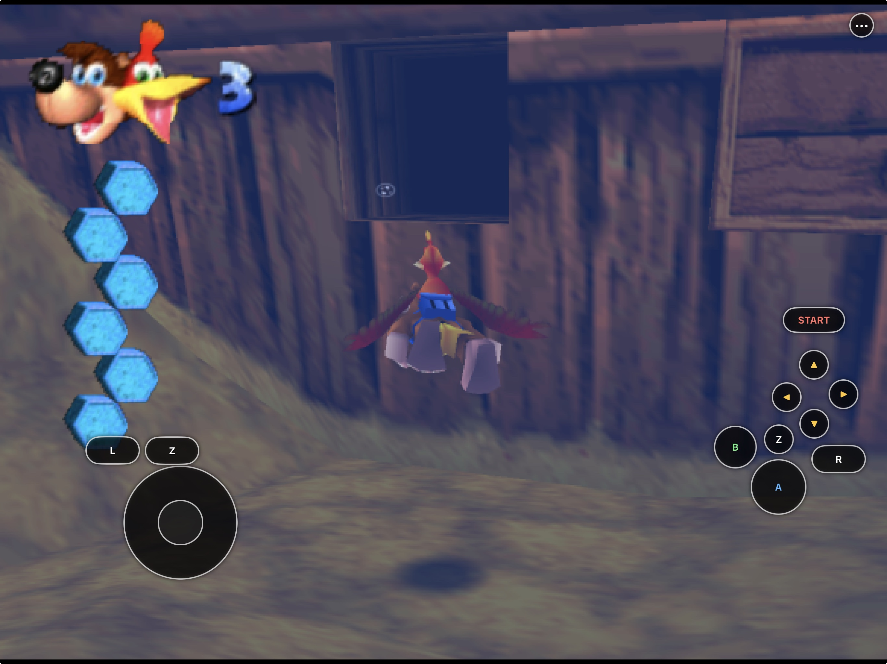
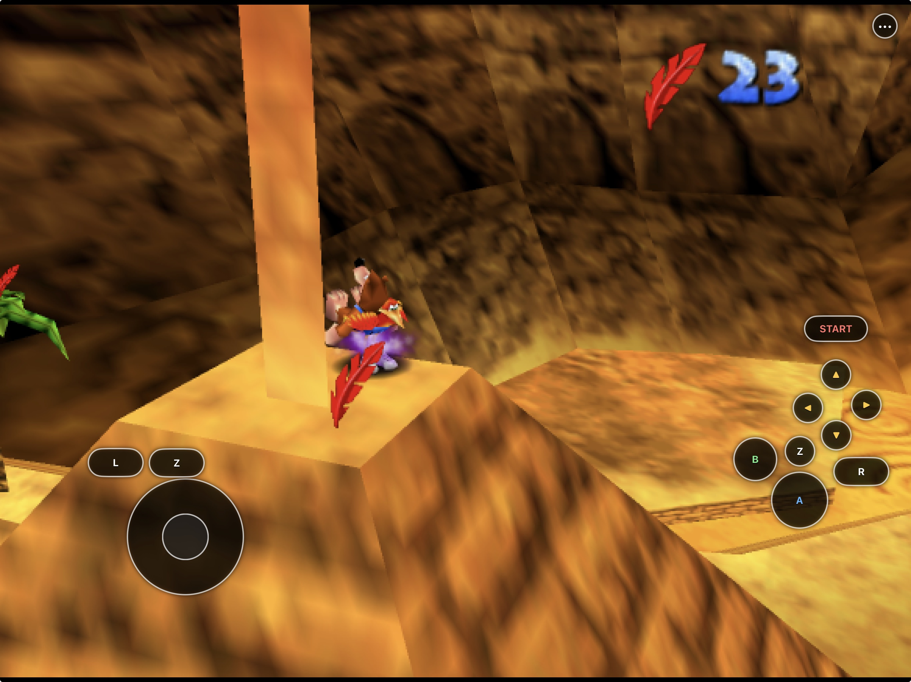
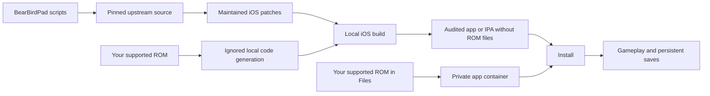

# BearBirdPad

<p align="center">
  <strong>Banjo-Kazooie, rebuilt for iPhone and iPad.</strong><br>
  Native Metal rendering, customizable touch controls, Files-based setup,
  controller support, persistent saves, and ROM-free packaging.
</p>

<p align="center">
  
  
  
  
  <a href="https://github.com/chrissotraidis/bearbirdpad/releases/tag/v0.1.0-preview.1"></a>
  
  
</p>



The capture above and gallery below are from the current physical iPad build.
Game data was supplied locally and is not part of this repository.

BearBirdPad packages the full
[BanjoRecomp](https://github.com/BanjoRecomp/BanjoRecomp) source port as a
native iOS/iPadOS app. It renders through Plume/RT64 and Metal, imports a
user-provided supported Banjo-Kazooie ROM through Files, and includes a
landscape touch controller that can be moved, resized, or simplified for each
device class.

This repository contains the mobile integration, maintained patches, and
reproducible build scripts. It does **not** contain Banjo-Kazooie, a ROM,
saves, extracted assets, or a playable preconfigured build. Read the scoped
[`rights and licensing boundary`](RIGHTS_AND_LICENSES.md) and
[`third-party license audit`](THIRD_PARTY_NOTICES.md). BearBirdPad-owned software
is GPL-3.0-or-later; third-party projects and game material retain their own
rights and are not relicensed.

## Gameplay on iPad

<table>
  <tr>
    <td width="50%">
      <br>
      <sub><strong>World interaction.</strong> Dialogue and camera framing remain readable while the touch controller stays available.</sub>
    </td>
    <td width="50%">
      <br>
      <sub><strong>Aerial exploration.</strong> The full virtual N64 layout supports flying and traversal.</sub>
    </td>
  </tr>
  <tr>
    <td width="50%">
      <br>
      <sub><strong>Underwater traversal.</strong> Analog movement and action controls remain accessible while swimming.</sub>
    </td>
    <td width="50%">
      <br>
      <sub><strong>Talon Trot.</strong> Simultaneous touch input supports compound moves and faster traversal.</sub>
    </td>
  </tr>
</table>

## Install status

| Option | Status | What to do |
|---|---|---|
| Local iPhone or iPad build | **Available now** | Build and sign with your Apple development team using the instructions below. |
| Simulator | **Available now** | Best for development and UI testing; it is not a substitute for physical-device testing. |
| Developer-preview `.ipa` | **Available now** | [Download preview 0.1.0 build 1](https://github.com/chrissotraidis/bearbirdpad/releases/download/v0.1.0-preview.1/BearBirdPad-0.1.0-preview.1-unsigned.ipa), then sign it for your device using the [installation guide](docs/INSTALL_IPA.md). |
| App Store / TestFlight | **Not announced** | No listing or public TestFlight currently exists. |

The current development build has been signed, installed, launched, and
played on:

- a 12.9-inch iPad Pro (6th generation) running iPadOS 26.5.2; and
- an iPhone 14 running iOS 26.5.2.

On those devices, local ROM loading, native Metal gameplay, touch input,
settings, device-specific layouts, save transfer, save reload, and in-place
app updates preserving the Documents container have been exercised. The
current build is stable in regular playtesting; a wider controller,
audio-route, interruption, and performance matrix remains open.

## Download the developer preview

[Download BearBirdPad 0.1.0 Preview 1](https://github.com/chrissotraidis/bearbirdpad/releases/tag/v0.1.0-preview.1).
The IPA is unsigned: it must be signed with your own Apple ID before it can be
installed. Follow [`docs/INSTALL_IPA.md`](docs/INSTALL_IPA.md) for the short
installation and update procedure.

The download contains no ROM, save, extracted game assets, generated-source
tree, provisioning profile, or maintainer certificate. You must provide your
own legally acquired Banjo-Kazooie NTSC-U 1.0 ROM after installation. The
compiled executable necessarily contains statically recompiled game code, as
the upstream BanjoRecomp desktop releases do; “ROM-free” does not mean that
the executable is independent of the original game code.

## Get started

You need:

- an Apple-silicon Mac with Xcode and its command-line tools;
- [Homebrew](https://brew.sh);
- an Apple ID configured in Xcode for physical-device signing; and
- your own legally acquired Banjo-Kazooie NTSC-U 1.0 cartridge dump.

Install the command-line dependencies:

```sh
brew install cmake ninja rust
```

Clone and build:

```sh
git clone https://github.com/chrissotraidis/bearbirdpad.git
cd bearbirdpad

scripts/fetch-sources.sh
scripts/build-host-tools.sh
scripts/prepare-generated.sh "/absolute/path/to/Banjo-Kazooie (USA).n64"

# Simulator
scripts/build-ios.sh --simulator --app --config Release

# Physical iPhone or iPad
DEVELOPMENT_TEAM=ABCDE12345 \
  scripts/build-ios.sh --device --app --config Release
```

Replace `ABCDE12345` with the 10-character Team ID shown in Xcode. The device
app is written to:

```text
build-ios-app-device/Release/BanjoRecompiled.app
```

See [`docs/BUILDING-IOS.md`](docs/BUILDING-IOS.md) for the complete ROM
validation, Simulator, signing, installation, and package-audit workflow.
Before publishing or sharing a build, follow the
[`release checklist`](docs/RELEASE_CHECKLIST.md).

## First launch

BearBirdPad never downloads or bundles game data.

1. Launch BearBirdPad.
2. Choose **Load ROM**.
3. Select your legally acquired Banjo-Kazooie NTSC-U 1.0 ROM from Files.
4. Wait for validation to finish, then choose **Start Game**.
5. On later launches, BearBirdPad validates and reuses the stored local ROM.

`.z64`, `.v64`, and `.n64` byte orders are accepted. The selected ROM remains
inside the app's Documents container and is never part of this repository or
its package output.

## Touch controls

BearBirdPad provides every standard N64 input needed for play:

- a virtual analog stick;
- A, B, Start, L, R, and two independently tracked Z targets;
- four C buttons and an optional D-pad;
- simultaneous multi-touch for moves such as Z-plus-C combinations; and
- a persistent `•••` menu button kept inside the current safe area.

Open **Settings → Controls → Customize Touch Layout** while the game is
running to move, resize, hide, show, or reset controls. Phone and tablet
layouts are intentionally stored in separate `phone-v1` and `tablet-v1`
profiles. Editing one device class does not overwrite the other.

See [`docs/TOUCH-CONTROLS.md`](docs/TOUCH-CONTROLS.md) for the editor contract
and visibility rules.

## Saves and settings

Saves live in the app's Files-visible Documents container and are written with
primary and backup files. Installing a new build **over the existing app**
preserves that container, including:

- `Documents/BanjoRecompiled/saves/`;
- the stored ROM and texture packs; and
- gameplay configuration.

Do not delete the app before updating: iOS removes its container when the app
is deleted. Back up the `saves` directory before changing bundle identifiers,
re-signing with an incompatible identity, or removing the installation.

Touch-layout preferences also survive in-place updates, but phone and tablet
geometry stays separate so an iPad layout cannot distort the iPhone controls.

## What works

| Area | Current result |
|---|---|
| Native app | Universal arm64 iPhone/iPad app with an iOS 16.0 deployment target |
| Rendering | Plume/RT64 Metal rendering in Simulator and on physical iPhone/iPad |
| Game setup | NTSC-U 1.0 validation and Files import for `.z64`, `.v64`, and `.n64` |
| Touch | Simultaneous N64 controls, safe-area menu access, and separate customizable phone/tablet layouts |
| Controllers | SDL's iOS-compatible MFi, PlayStation, and Xbox input path is included |
| Saves | Files-visible save/backup files, transfer between devices, and in-place update persistence |
| Mods | `.rtz` texture-pack import through Files or the Mods picker |
| Lifecycle | Rendering, configuration, save flushing, and audio recovery are integrated with app backgrounding |
| Packaging | Deterministic IPA wrapping with ROM, generated-source, and signing audits |

For the exact evidence and remaining device matrix, see
[`docs/STATUS.md`](docs/STATUS.md). Texture-pack setup is documented in
[`docs/TEXTURE-PACKS.md`](docs/TEXTURE-PACKS.md).

## Reproducible and game-data safe



Unlike an emulator, BanjoRecomp uses a supported ROM locally to generate part
of the build input. `scripts/prepare-generated.sh` writes that material only
under ignored source/build directories. The package audit rejects original
ROM files, known ROM digests, generated-source paths, and signing mistakes
before an app or IPA is accepted.

The compiled program necessarily contains recompiled game code, as upstream
BanjoRecomp builds do. “ROM-free” here means the repository and packaged app
do not contain the user's ROM file or the generated-source files; it is not a
claim about rights in the original game.

## Frequently asked questions

<details>
<summary><strong>Where is the IPA?</strong></summary>

[Download the unsigned developer-preview IPA from GitHub Releases](https://github.com/chrissotraidis/bearbirdpad/releases/tag/v0.1.0-preview.1),
then follow the [installation guide](docs/INSTALL_IPA.md) to sign it for your
iPhone or iPad.
</details>

<details>
<summary><strong>Does this repository include Banjo-Kazooie?</strong></summary>

No. You must provide your own legally acquired supported ROM. Do not open
issues requesting game data or download links.
</details>

<details>
<summary><strong>Will installing a new build erase my save?</strong></summary>

An in-place install with the same bundle identity preserves Documents and
preferences. Deleting the app does not. Back up
`Documents/BanjoRecompiled/saves/` before any destructive reinstall.
</details>

<details>
<summary><strong>Can I use the same touch layout on iPhone and iPad?</strong></summary>

BearBirdPad keeps separate phone and tablet profiles. This prevents a comfortable
iPad layout from producing overlapping or misplaced controls on iPhone.
</details>

<details>
<summary><strong>Does it support texture packs?</strong></summary>

Yes. BearBirdPad imports `.rtz` packs through Files and exposes them in the Mods
menu. See [`docs/TEXTURE-PACKS.md`](docs/TEXTURE-PACKS.md).
</details>

<details>
<summary><strong>Is this an App Store or TestFlight release?</strong></summary>

No. App Store, TestFlight, and third-party sideloading distribution each have
separate signing, review, account, and compliance requirements.
</details>

## Project map

| Path | Purpose |
|---|---|
| [`scripts/build-ios.sh`](scripts/build-ios.sh) | Complete Simulator or device build |
| [`scripts/package-ios.sh`](scripts/package-ios.sh) | Deterministic IPA creation after package audit |
| [`scripts/check-repo-safety.sh`](scripts/check-repo-safety.sh) | Fast tracked-asset, history, patch, script, and documentation gate |
| [`patches/`](patches/) | BearBirdPad changes replayed onto pinned upstream source |
| [`ios/`](ios/) | Native iOS shell, Files integration, lifecycle, and touch overlay |
| [`docs/BUILDING-IOS.md`](docs/BUILDING-IOS.md) | Full build, signing, installation, and testing guide |
| [`docs/INSTALL_IPA.md`](docs/INSTALL_IPA.md) | Developer-preview IPA installation and safe updates |
| [`docs/RELEASE_CHECKLIST.md`](docs/RELEASE_CHECKLIST.md) | Source and IPA publication gates |
| [`docs/TOUCH-CONTROLS.md`](docs/TOUCH-CONTROLS.md) | Touch layout and editor contract |
| [`docs/STATUS.md`](docs/STATUS.md) | Current physical-device evidence and open checks |
| [`ref/`](ref/) | Ignored local reference area; only its safety README is tracked |

Generated source trees, build directories, artifacts, ROMs, saves, device
backups, and ROM-derived data are ignored and must never be committed.

## Contributing and support

Use the structured
[bug report](https://github.com/chrissotraidis/bearbirdpad/issues/new/choose)
for reproducible gameplay or platform defects. Read
[`CONTRIBUTING.md`](CONTRIBUTING.md) before proposing a change and
[`SECURITY.md`](SECURITY.md) before reporting a sensitive vulnerability.
Never attach or request game data.

## Legal and acknowledgements

BearBirdPad is an unofficial community project and is not affiliated with or
endorsed by Nintendo, Microsoft, Rare, or the BanjoRecomp project. It does not
provide the game, ROM downloads, saves, or extracted game data.

BearBirdPad-owned software, scripts, patches, and documentation are licensed
under GPL-3.0-or-later. See [`LICENSE`](LICENSE),
[`RIGHTS_AND_LICENSES.md`](RIGHTS_AND_LICENSES.md), and
[`THIRD_PARTY_NOTICES.md`](THIRD_PARTY_NOTICES.md). The gameplay screenshots,
game imagery, names, logos, and trademarks are not included in that license.

This project builds on BanjoRecomp, N64ModernRuntime, N64Recomp, RT64, Plume,
RecompFrontend, SDL, bk-decomp, and their contributors. All projects,
copyrights, and trademarks belong to their respective owners.
